# LAB1 - deploy AS3 config
## How it works
  * GitLab - source code and version control
  * GitLab runner - executes pipeline, runs Ansible commands in this case
  * Ansible - deploys configuration
  * BIG-IP - get configured
  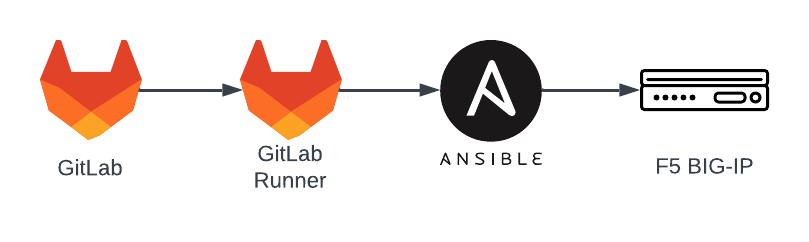
## 1) Check BIG-IP configuration
  * Access bigip1 tmui, credentials are admin/heslohesel123
  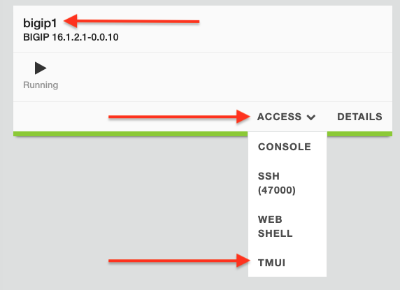
  * Check Local Traffic - Virtual Servers and partitions
  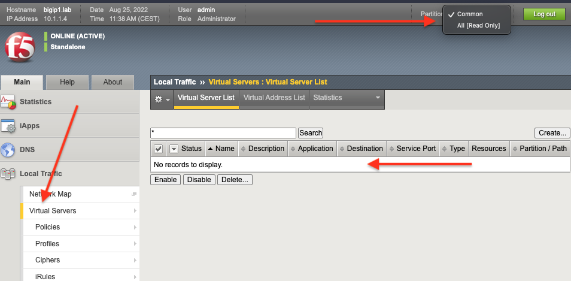
  * no configuration present, lets create some:
  
## 2) Explore GitLab
  * Access GitLab from UDF:
  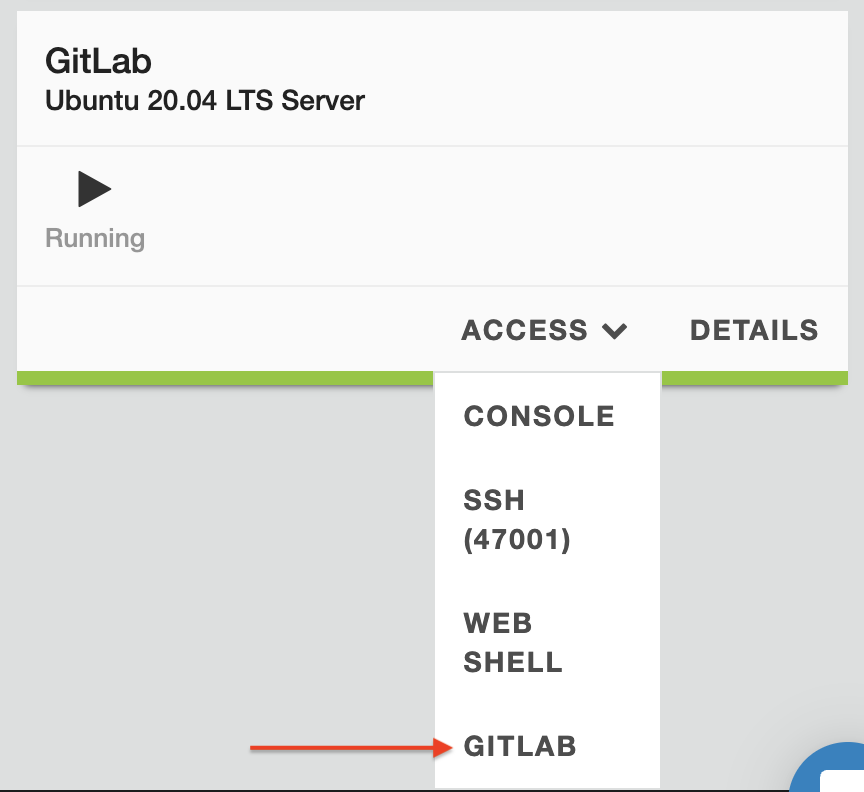
  * login as root/heslohesel123
  * access lab1 repository:
  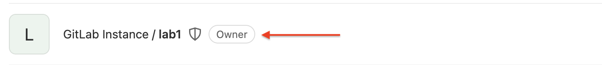


## 3) Create configuration in GitLab project
  ### Define pipeline
  Pipeline is used to execute code, is separated into stages, stages are run in sequence, if one fails pipeline stops
  * Go to CI/CD -> Editor and click "Create pipeline" button
  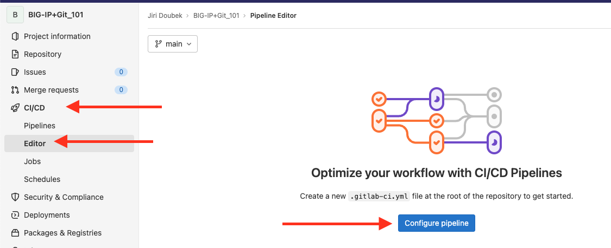
  * Pipeline example is generated, lets replace it. We will use two stages:
    * Requirements
    * Configure_LTM
  * Definition looks like this:
  ```
  stages:
    - Requirements
    - Configure_LTM
  ```
  * Requirements stage will install ansible modules needed, f5networks.f5_bigip in this case:
  ```
  Requirements:
    stage: Requirements
    script:
        - ansible-galaxy collection install -r 1-requirements.yml
  ```
  * Configure stage will run ansible playbook to deliver AS3 declaration to BIG-IP:
  ```
  Configure_LTM:
    stage: Configure_LTM
    script:
        - ansible-playbook 2-config-ltm.yml -vvv
  ```
  * Whole pipeline should look like:
 ```
stages:
    - Requirements
    - Configure_LTM

Requirements:
    stage: Requirements
    script:
        - ansible-galaxy collection install -r 1-requirements.yml

Deploy_LTM:
    stage: Configure_LTM
    script:
        - ansible-playbook 2-config-ltm.yml -vvv

```
### Create configuration files
  * Pipeline is referring to file 1-requirements.yml, lets create it:
    * Go to Repository -> Files and create new file:
    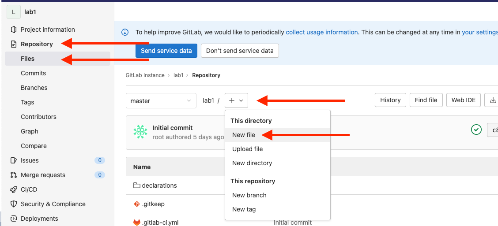
    * name: 1-requirements.yml
    * Content:
```
---
# Install a Collection from Galaxy
collections:
  - name: f5networks.f5_bigip
    version: 1.9.0
```
  * pipeline deploys AS3 config via 2-config-ltm.yml
    * create 2-config-ltm.yml file with following content:
```
---
- name: AS3
  hosts: bigip1
  vars:
    ansible_user: "admin"
    ansible_httpapi_password: "heslohesel123"
    ansible_httpapi_port: "443"
    ansible_network_os: f5networks.f5_bigip.bigip
    ansible_httpapi_use_ssl: yes
    ansible_httpapi_validate_certs: false
    ansible_command_timeout: 1800
    ansible_httpapi_use_proxy: false
  connection: httpapi
  gather_facts: false

  tasks:   

    - name: Deploy or Update
      f5networks.f5_bigip.bigip_as3_deploy:
          content: "{{ lookup('file', '2-as3.json') }}"
```
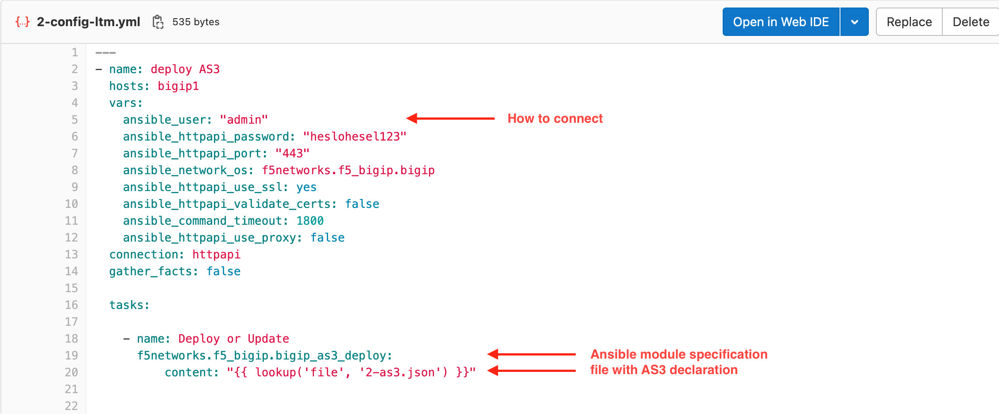
  * Ansible module 
    * we are using [f5_bigip declarative collection](https://clouddocs.f5.com/products/orchestration/ansible/devel/f5_bigip/f5_bigip.html)  
      * [list of modules](https://clouddocs.f5.com/products/orchestration/ansible/devel/f5_bigip/modules_2_0/module_index.html)
      * [bigip_as3_deploy](https://clouddocs.f5.com/products/orchestration/ansible/devel/f5_bigip/modules_2_0/bigip_as3_deploy_module.html#bigip-as3-deploy-module-2)
  * Lets create AS3 declaration to publish app running on server 10.1.10.10 on port 8080, HTTP virtual server will be 10.1.10.100 
    * create 2-as3.yml file with following content:
```
{
  "class": "AS3",
  "action": "deploy",
  "persist": true,
  "declaration": {
    "class": "ADC",
    "schemaVersion": "3.22.0",
    "id": "id",
    "label": "WebApp",
    "ansible": {
      "class": "Tenant",
      "WebGoat-app": {
        "class": "Application",
        "WebGoat-svc": {
          "class": "Service_HTTP",
          "virtualAddresses": [
            "10.1.10.100"
            ],
          "virtualPort": 80,
          "pool": "WebGoat_pool"
        },
        "WebGoat_pool": {
          "class": "Pool",
          "monitors": [{"use": "http_mon"}],
          "members": [
            {
              "servicePort": 80,
              "serverAddresses": [
                "10.1.10.10"
              ]
            }
          ]
        },
        "http_mon": {
            "class": "Monitor",
            "monitorType": "http",
            "send":"GET /WebGoat/login HTTP/1.1\r\nHost: apps.lab\r\nConnection: Close\r\n\r\n",
            "receive": "Sign in"
        }
      }
    }
  }
}
```
  * [AS3](https://clouddocs.f5.com/products/extensions/f5-appsvcs-extension/latest/) declaration - basic HTTP declaration to publish WebGoat app:
  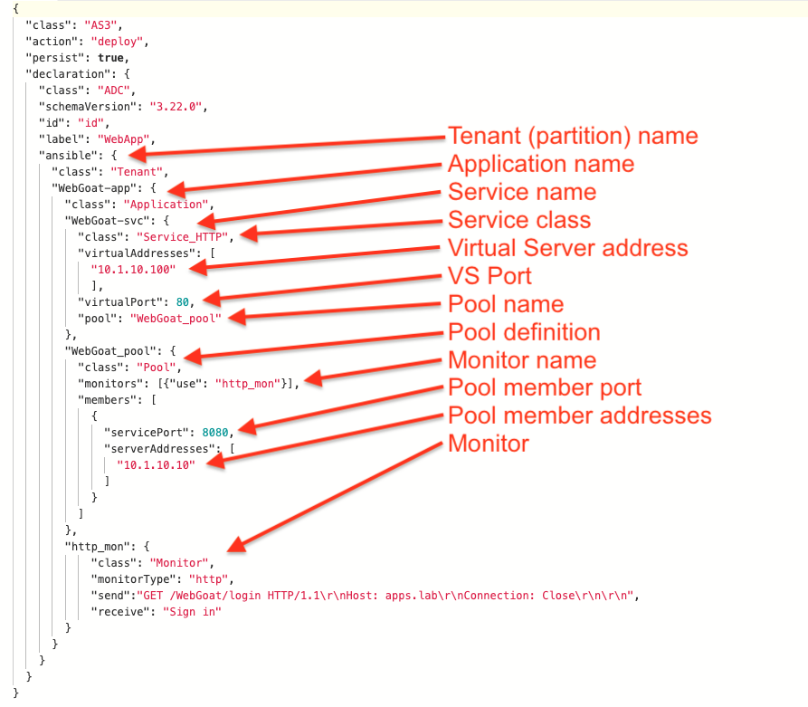
    * tenant = partition
    * tenant can conatain multiple applications, these are in folders
    * application can contain multiple services
    * service definition is VS + Pool + monitor etc.
    * [Composing AS3 decalaration](https://clouddocs.f5.com/products/extensions/f5-appsvcs-extension/latest/userguide/composing-a-declaration.html)

### Check pipeline
  * Go to CI/CD -> Pipelines:\
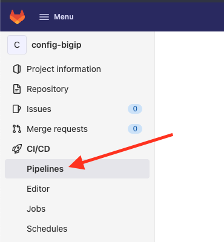
  * Check latest pipeline, click "Passed" status\
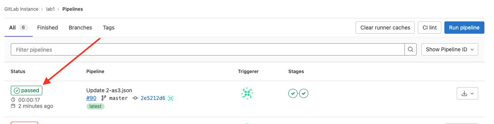
  * explore executed jobs\
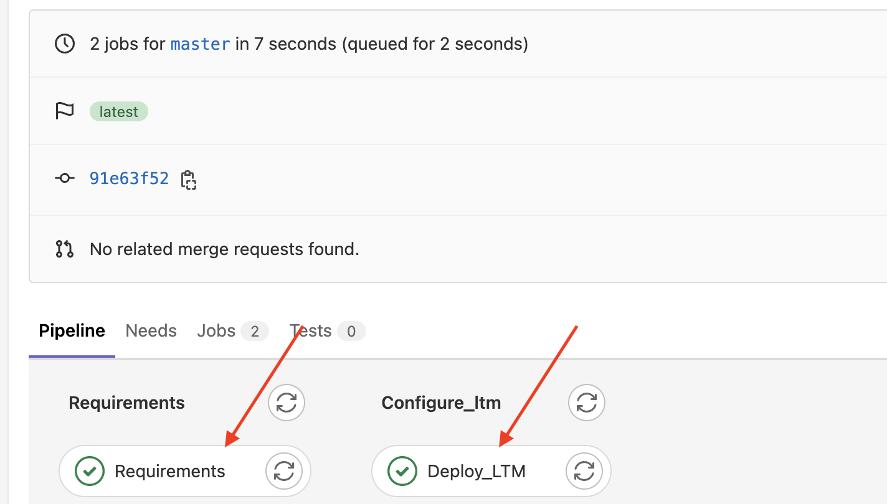

## 4) Check BIG-IP configuration
  * Access bigip1 tmui, credentials are admin/heslohesel123
  
  * Check Local Traffic - Virtual Servers in partition ansible - tenant defined in AS3 declaration
  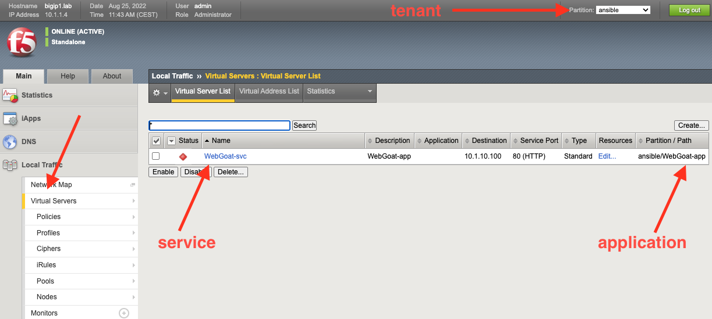
  * explore VS, pool, monitor.
  * pool is down, whats the reason?

## 5) modify AS3, add check to pipeline
### modify as3
  * go back to GitLab
  * open 2-as3.json file
  * click Open in Web IDE, which enables you to browse, modify and create files in repository
  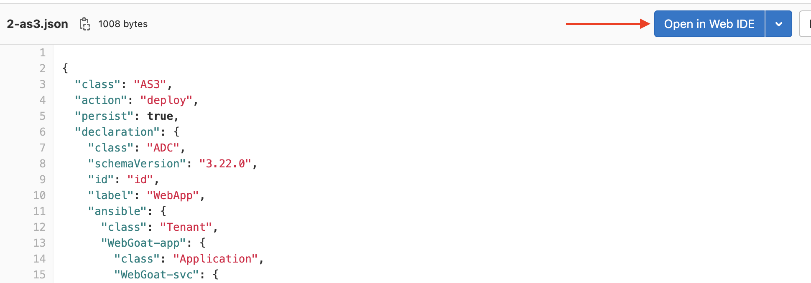
  * change pool port to 8080 and create commit:
  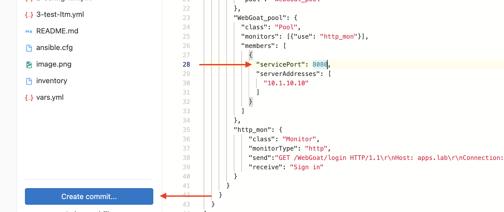
  * you can see diff of changes, lets commit to **master** branch:
  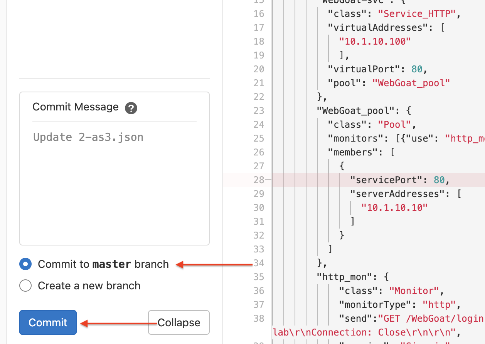
### add application check to pipeline
  * you can edit pipeline definition from Web IDE as well, open .gitlab-ci.yml file:
  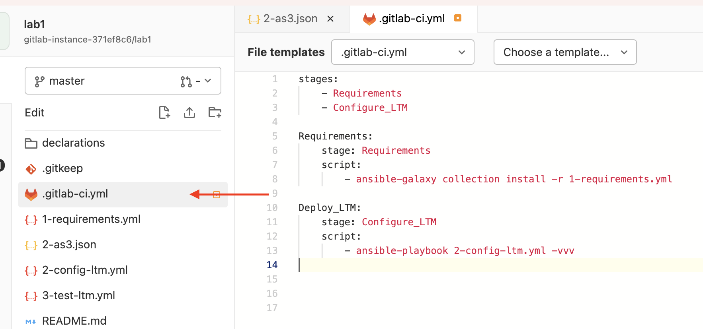
  * add Test_LTM stage and instruct it to run ansible playbook:
```
stages:
    - Requirements
    - Configure_LTM
    - Test_LTM

Requirements:
    stage: Requirements
    script:
        - ansible-galaxy collection install -r 1-requirements.yml

Deploy_LTM:
    stage: Configure_LTM
    script:
        - ansible-playbook 2-config-ltm.yml -vvv

Test_LTM:
    stage: Test_LTM
    script:
        - ansible-playbook 3-test-ltm.yml -vvv
```
  * create 3-test-ltm.yml file:
  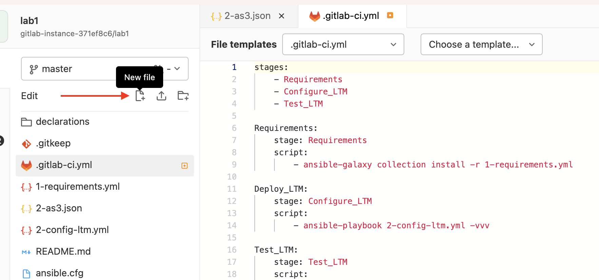
  * use following content:
```
---
- hosts: localhost
  connection: local
  gather_facts: false
  tasks:

# WebGoat normal content check
    - name: Check that a page returns a status 200 and fail if the words Register new user are not in the page contents
      uri:
        url: "http://10.1.10.100/WebGoat/login"
        return_content: true
      register: request
      until: "'Register new user' in request.content"
      retries: 15
      delay: 10

```
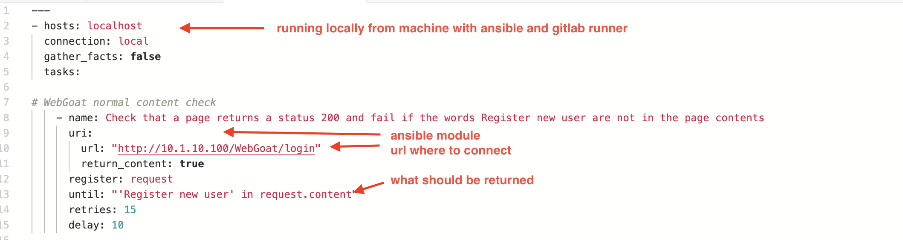
  * we are using [default ansible uri module](https://docs.ansible.com/ansible/latest/collections/ansible/builtin/uri_module.html)
  * commit to **master**
  * check pipeline, now there are 3 stages and we know that app is accessible if pipeline succeeds

### 6) Check WebGoat app
#### check bigip
  * access bigip1 tmui
  * check Local Traffic - Virtual Servers in partition ansible - tenant defined in AS3 declaration
  * explore VS, pool, monitor.
#### access WebGoat app
  * WebShell on GitLab:

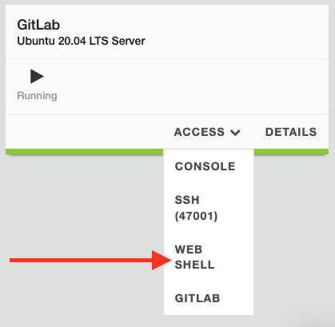
  * `curl http://10.1.10.100/WebGoat/login`
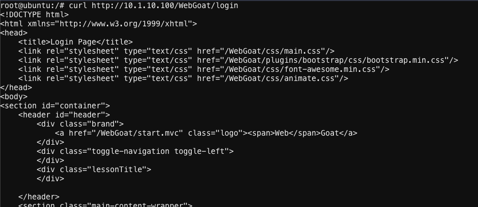
  * UDF - bigip1 - WebGoat:
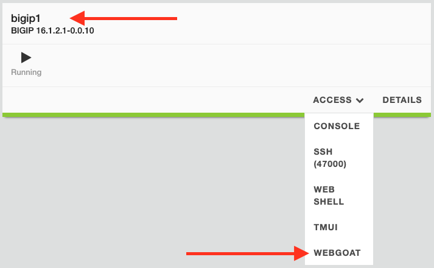

#### Ok, it works. Could it work better, faster, more dynamically? Go to [Lab 2](/Lab2-AS3&Templates/)


  
