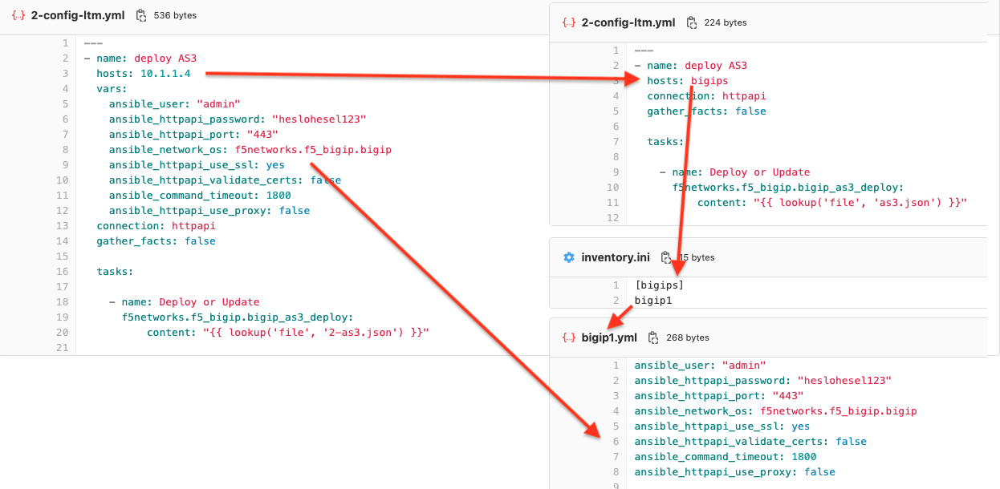
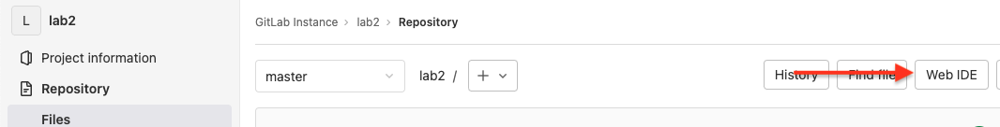
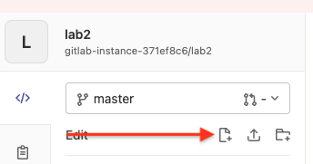
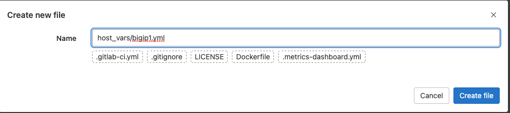
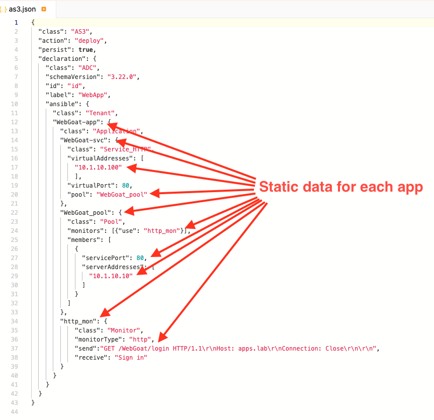
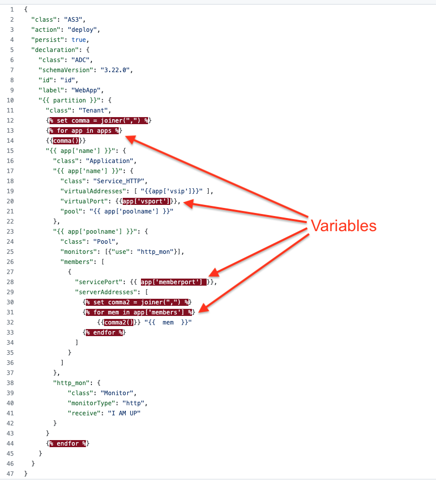
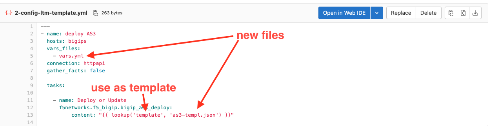

# Lab2 - Variables, AS3, Templates, Jinja, ...
## 1) Start using inventory
### Create inventory file
  * In ansible playbook we have defined how to connect to bigip. If we were running more playbooks we would have to define it in every single one on them.
  * Ansible normally works with [inventory](https://docs.ansible.com/ansible/latest/user_guide/intro_inventory.html), not static definitions of hosts.
  * Name of inventory file is defined in pre-created ansible.cfg file
  * Lets create `inventory.ini` file, where we create group `bigips`, that will contain all our bigips where we want to deploy app. In this case it is bigip1 :
```
[bigips]
bigip1
```
  * You can have many groups with different systems
  * We are going to use `hosts: bigips` in following ansible playbooks.
### Group and host vars
  * Each group and host can have its variables, usually are used to define connection to given group (all bigips for example) or host (one bigip)
  * Group variables are placed in `[group name].yml` file in `group_vars` folder 
  * Host variables are placed in `[host name].yml` file in `host_vars` folder
  * We are going to move variables that defines connection to host from playbook to host variables:

  * Since we have only one bigip, lets create `bigip1.yml` file in `host_vars` directory
  * Lets open WebIde, which allows you to create and modify more files and commit all at once:
  

  * Create new file while defining new directory at the same time:

 \

  * Content of bigip1.yml file:
```
ansible_user: "admin"
ansible_httpapi_password: "heslohesel123"
ansible_httpapi_port: "443"
ansible_network_os: f5networks.f5_bigip.bigip
ansible_httpapi_use_ssl: yes
ansible_httpapi_validate_certs: false
ansible_command_timeout: 1800
ansible_httpapi_use_proxy: false
```

## 2) Create new playbook
  * Create 2-config-ltm.yml file:
```
---
- name: deploy AS3
  hosts: bigips
  connection: httpapi
  gather_facts: false

  tasks:   

    - name: Deploy or Update
      f5networks.f5_bigip.bigip_as3_deploy:
          content: "{{ lookup('file', 'as3.json') }}"
```
  
## 3) Deploy with vars files
  * Files **1-requirements.yml, 3-test-ltm.yml, as3.json** are already prepared.
  * Create Pipeline definition, either create `.gitlab-ci.yml` file or go to CI/CD -> Editor and create same pipeline as in lab1:
```
stages:
    - Requirements
    - Configure_LTM
    - Test_LTM

Requirements:
    stage: Requirements
    script:
        - ansible-galaxy collection install -r 1-requirements.yml

Deploy_LTM:
    stage: Configure_LTM
    script:
        - ansible-playbook 2-config-ltm.yml -vvv

Test_LTM:
    stage: Test_LTM
    script:
        - ansible-playbook 3-test-ltm.yml -vvv
```
  * Commit changes to **master** branch
  * Check pipeline
  * **Was it deployed?**
  ## 4) Improve AS3 declaration
  * Current config is quite static, we would have to create new one for each app:
  
  ### To keep up pace with development, we need to make it more dynamic
  * Lets create a file, that describes new application to be deploeyd
  * We are again deploying WebGoat, this time on servers 10.1.10.11 and 10.1.10.12 on port 8080, published at 10.1.10.101 with specific http monitoring
  * Create vars.yml:
```
partition: lab2
apps:
      - name: webgoat
        vsip: 10.1.10.101
        vsport: 80
        memberport: 8080
        monurl: '/WebGoat/login'
        monreceive: 'Sign in'
        poolname: webgoat_pool
        members:
          - 10.1.10.11
          - 10.1.10.12
```
  * We will be using [Jinja](https://palletsprojects.com/p/jinja/) - template engine for Python to put these variables into template
  * Lets create a template file - as3-templ.json:
```
{
  "class": "AS3",
  "action": "deploy",
  "persist": true,
  "declaration": {
    "class": "ADC",
    "schemaVersion": "3.22.0",
    "id": "id",
    "label": "WebApp",
    "{{ partition }}": {
      "class": "Tenant",
      
      
      {{comma()}}
      "{{ app['name'] }}": {
        "class": "Application",
        "{{ app['name'] }}": {
          "class": "Service_HTTP",
          "virtualAddresses": [ "{{app['vsip']}}" ],
          "virtualPort": {{app['vsport']}},
          "pool": "{{ app['poolname'] }}"
        },
        "{{ app['poolname'] }}": {
          "class": "Pool",
          "monitors": [{"use": "{{ app['name'] }}_mon"}],
          "members": [
            {
              "servicePort": {{ app['memberport'] }},
              "serverAddresses": [
                
                
                    {{comma2()}} "{{  mem  }}"
                
              ]
            }
          ]
        },
        "{{ app['name'] }}_mon": {
            "class": "Monitor",
            "monitorType": "http",
            "send": 'GET {{ app['monurl'] }}  HTTP/1.1\r\nHost: apps.lab\r\nConnection: Close\r\n\r\n',
            "receive": "{{ app['monreceive'] }}"
        }
      }
      
    }
  }
}

```

  * Lets create replacement for our 2-config-ltm.yml, we will name it 2-config-ltm-template.yml. Changes:

```
---
- name: deploy AS3
  hosts: bigips
  vars_files:
    - vars.yml
  connection: httpapi
  gather_facts: false

  tasks:   

    - name: Deploy or Update
      f5networks.f5_bigip.bigip_as3_deploy:
          content: "{{ lookup('template', 'as3-templ.json') }}"
```
  * modify pipeline to use new playbook .gilab-ci.yml:
```
stages:
    - Requirements
    - Configure_LTM
    - Test_LTM

Requirements:
    stage: Requirements
    script:
        - ansible-galaxy collection install -r 1-requirements.yml

Deploy_LTM:
    stage: Configure_LTM
    script:
        - ansible-playbook 2-config-ltm-template.yml -vvv

Test_LTM:
    stage: Test_LTM
    script:
        - ansible-playbook 3-test-ltm.yml -vvv
```
  * Commit changes to **master** branch
  * Check pipeline
  * **Was it deployed?**
  * Check config in BIG-IP
## 5) Improve testing script
  * Now 3-test-ltm.yml is still monitoring deployment of statically defined application. Even different than we are deploying.
  * Create 3-test-vars.yml that will take variables from vars.yml file and test application accordingly:
```
---
- hosts: localhost
  connection: local
  vars_files:
    - vars.yml
  gather_facts: false
  tasks:

    - name: Check that a page returns what it should
      uri:
        url: "http://{{ item.vsip }}{{ item.monurl }}"
        return_content: true
      register: request
      # until: request.status == 200
      until: "'{{ item.monreceive }}' in request.content"
      retries: 15
      delay: 10
      with_items:
        - "{{ apps }}"
```
  * We are using normal [Ansible loop](https://docs.ansible.com/ansible/latest/user_guide/playbooks_loops.html) it goes through apps list and runs task for each variable in apps
  * Commit changes to **master** branch
  * Check pipeline
## 6) Add Echo application
  * There is new application, running on webservers 10.1.10.13 and 10.1.10.14 on port 8088, lets publish it on 10.1.10.102 port 80. It replies request, so it can be monitored by sending random string and receiving it
  * Modify vars.yml to contain definition of new app as well:
```
partition: lab2
apps:
      - name: webgoat
        vsip: '10.1.10.101'
        vsport: 80
        memberport: 8080
        monurl: '/WebGoat/login'
        monreceive: 'Sign in'
        poolname: webgoat_pool
        members:
          - 10.1.10.11
          - 10.1.10.12

      - name: echo
        vsip: '10.1.10.102'
        vsport: 80
        memberport: 8088
        monurl: '/helloworld'
        monreceive: 'helloworld'
        poolname: echo_pool
        members:
          - 10.1.10.13
          - 10.1.10.14
```
  * Commit changes to **master** branch
  * Check pipeline
  * Check AS3 decalaration in deploy-ltm job
    * does it contain both apps in one tenant?
  * Check Virtual Servers in Lab2 partition on BIG-IP
  * Access both apps from UDF
  * Explore ansible.cfg file we have been using whole time
  * Hope you enjoyed the lab.
