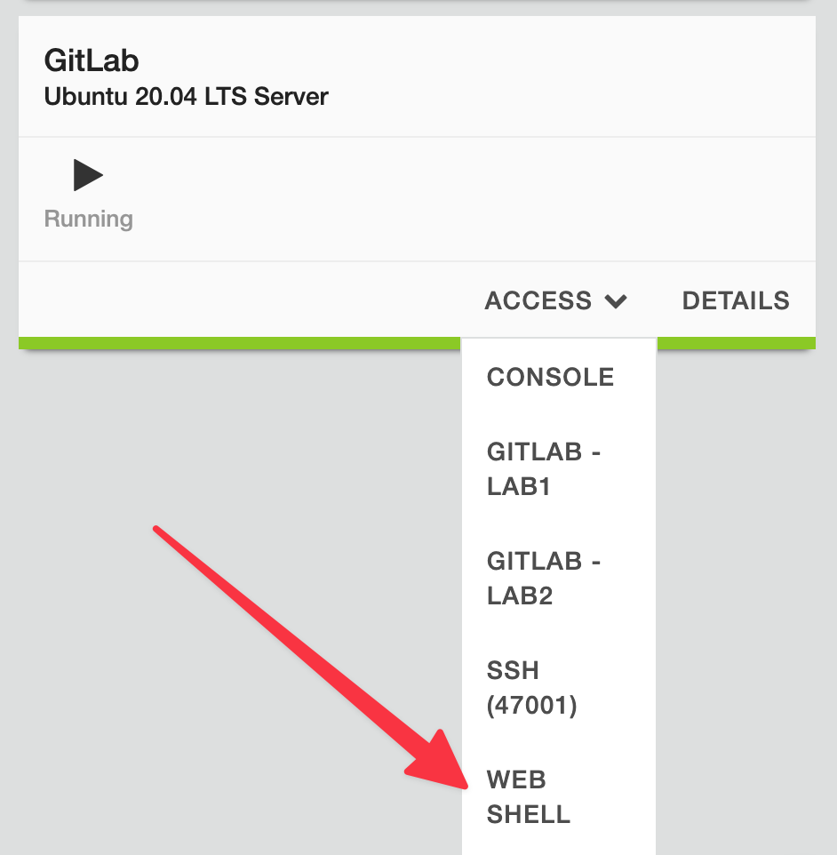
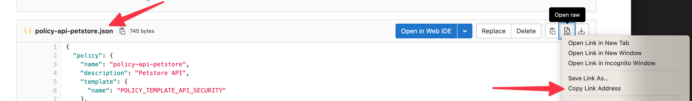
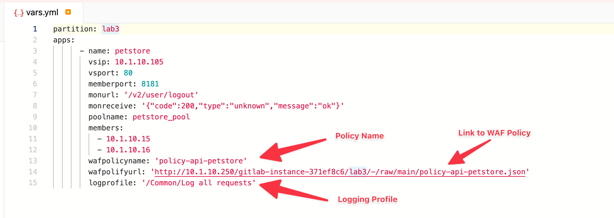
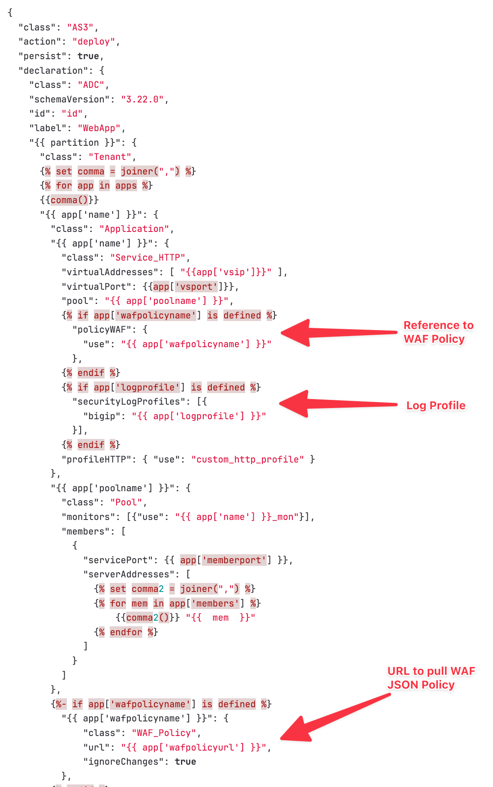
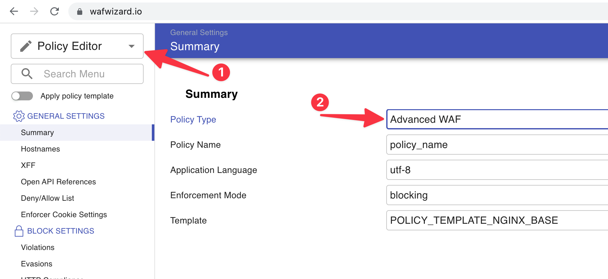

# Lab3 - AS3 and WAF Policy
> In this lab, we are going to reuse components from the previous lab and build on top of it. You should be familiar with most of the components.
## 1) Start using inventory
### Create inventory file
  * Let's create `inventory.ini` file, where we create group `bigips`, that will contain all our BIG-IPs where we want to deploy app. In this case it is `bigip1`:
```
[bigips]
bigip1
```
  * You can have many groups with different systems
  * We are going to use `hosts: bigips` in following Ansible playbooks.
### Group and host vars
  * Let's create `bigip1.yml` file in `host_vars` directory,
  * Content of `bigip1.yml` file:
```
ansible_user: "admin"
ansible_httpapi_password: "heslohesel123"
ansible_httpapi_port: "443"
ansible_network_os: f5networks.f5_bigip.bigip
ansible_httpapi_use_ssl: yes
ansible_httpapi_validate_certs: false
ansible_command_timeout: 1800
ansible_httpapi_use_proxy: false
```

## 2) Create dynamic deployment
* Let's create a file, that describes new application to be deployed,
* We are deploying an API based app **Petstore**, this time on servers **10.1.10.15** and **10.1.10.16** on port **8181**, published at **10.1.10.105** with specific http monitoring,
* Create `vars.yml`:
```yaml
partition: lab3
apps:
      - name: petstore
        vsip: 10.1.10.105
        vsport: 80
        memberport: 8181
        monurl: '/v2/user/logout'
        monreceive: '200'
        poolname: petstore_pool
        members:
          - 10.1.10.15
          - 10.1.10.16
```
  * Let's create a template file - `as3-templ.json`:
```json
{
  "class": "AS3",
  "action": "deploy",
  "persist": true,
  "declaration": {
    "class": "ADC",
    "schemaVersion": "3.22.0",
    "id": "id",
    "label": "WebApp",
    "{{ partition }}": {
      "class": "Tenant",
      
      
      {{comma()}}
      "{{ app['name'] }}": {
        "class": "Application",
        "{{ app['name'] }}": {
          "class": "Service_HTTP",
          "virtualAddresses": [ "{{app['vsip']}}" ],
          "virtualPort": {{app['vsport']}},
          "pool": "{{ app['poolname'] }}",
          
            "policyWAF": {
              "use": "{{ app['wafpolicyname'] }}"
            },
          
          
            "securityLogProfiles": [{
              "bigip": "{{ app['logprofile'] }}"
            }],
          
          "profileHTTP": { "use": "custom_http_profile" }
        },
        "{{ app['poolname'] }}": {
          "class": "Pool",
          "monitors": [{"use": "{{ app['name'] }}_mon"}],
          "members": [
            {
              "servicePort": {{ app['memberport'] }},
              "serverAddresses": [
                
                
                    {{comma2()}} "{{  mem  }}"
                
              ]
            }
          ]
        },
        
          "{{ app['wafpolicyname'] }}": {
              "class": "WAF_Policy",
              "url": "{{ app['wafpolicyurl'] }}",
              "ignoreChanges": true
          },
        
        "custom_http_profile": {
          "class": "HTTP_Profile",
          "xForwardedFor": true
        },
        "{{ app['name'] }}_mon": {
            "class": "Monitor",
            "monitorType": "http",
            "send": 'GET {{ app['monurl'] }}  HTTP/1.1\r\nHost: apps.lab\r\nConnection: Close\r\n\r\n',
            "receive": "{{ app['monreceive'] }}"
        }
      }
      
    }
  }
}
```
  * Let's create `2-config-ltm-template.yml`. Changes:
```yaml
---
- name: deploy AS3
  hosts: bigips
  vars_files:
    - vars.yml
  connection: httpapi
  gather_facts: false

  tasks:   

    - name: Deploy or Update
      f5networks.f5_bigip.bigip_as3_deploy:
          content: "{{ lookup('template', 'as3-templ.json') }}"
```
  * Let's create `3-test-vars.yml` that will take variables from `vars.yml` file and test application accordingly:
```yaml
---
- hosts: localhost
  connection: local
  vars_files:
    - vars.yml
  gather_facts: false
  tasks:

    - name: Check that a page returns what it should
      uri:
        url: "http://{{ item.vsip }}{{ item.monurl }}"
        return_content: true
      register: request
      # until: request.status == 200
      until: "'{{ item.monreceive }}' in request.content"
      retries: 15
      delay: 10
      with_items:
        - "{{ apps }}"
```

  * Create the pipeline `.gitlab-ci.yml` (`1-requirements.yml` file already exists):
```
stages:
    - Requirements
    - Configure_LTM
    - Test_LTM

Requirements:
    stage: Requirements
    script:
        - ansible-galaxy collection install -r 1-requirements.yml

Deploy_LTM:
    stage: Configure_LTM
    script:
        - ansible-playbook 2-config-ltm-template.yml -vvv

Test_LTM:
    stage: Test_LTM
    script:
        - ansible-playbook 3-test-vars.yml -vvv
```
  * Commit changes to **master** branch
  * Check pipeline
  * **Was it deployed?**
  * Check config in BIG-IP

## 3) Test the application
  * Access the `GitLab` server `WebShell` from UDF interface,

  * Interact with the API based application using the commands below:
  ```bash
  export PETSTORE_VS="10.1.10.105"

  # find available pets
  curl -ksX GET "http://${PETSTORE_VS}/v2/pet/findByStatus?status=available" -H  "accept: application/json" | jq

  # check the pet
  curl -ksX GET "http://${PETSTORE_VS}/v2/pet/7" -H  "accept: application/json" | jq

  # place order
  curl -ksX POST "http://${PETSTORE_VS}/v2/store/order" -H  "accept: application/json" -H  "Content-Type: application/json" -d "{  \"id\": 0,  \"petId\": 7,  \"quantity\": 1, \"shipDate\": \"2022-08-18T10:10:30.747Z\",  \"status\": \"placed\",  \"complete\": true}" | jq
  ```

  * The application is **unprotected** and **vulnerable** to different attacks,
  * Test the example attacks below:
  ```bash
  # changing order status to paid
  curl -ksX POST "http://${PETSTORE_VS}/v2/store/order" -H  "accept: application/json" -H  "Content-Type: application/json" -d "{  \"id\": 0,  \"petId\": 7,  \"quantity\": 1,  \"shipDate\": \"2020-08-18T10:10:30.747Z\",  \"status\": \"paid\",  \"complete\": true}" | jq

  # SQLi
  curl -ksX GET "http://${PETSTORE_VS}/v2/user/login?username=%27%20or%201%3D1%3B--%26password%3Dtest" -H  "accept: application/json" | jq

  # XSS
  curl -ksX GET "http://${PETSTORE_VS}/v2/user/login/<script>" -H  "accept: application/json" | jq

  # Accessing unauthorized endpoing /
  curl -ksX GET "http://${PETSTORE_VS}/"
  ```

## 4) Add WAF Policy
  * Using GitLab create a new WAF policy in JSON format `policy-api-petstore.json`:
  ```json
  {
      "policy": {
          "name": "policy-api-petstore",
          "description": "Petstore API",
          "template": {
              "name": "POLICY_TEMPLATE_API_SECURITY"
          },
          "enforcementMode": "blocking",
          "server-technologies": [
              {
                  "serverTechnologyName": "Node.js"
              },
              {
                  "serverTechnologyName": "Unix/Linux"
              },
              {
                  "serverTechnologyName": "MongoDB"
              }
          ],
          "signature-settings": {
              "signatureStaging": false
          },
          "policy-builder": {
              "learnOnlyFromNonBotTraffic": false
          },
          "open-api-files": [
              {
              "link": "https://petstore.swagger.io/v2/swagger.json"
              }
          ]
      }
  }
  ```
  * Commit changes to **master** branch

  * Copy link to **WAF Policy**:

  * Update the link to match Lab environment:
    * Change `https` to `http://`,
    * Change `*.access.udf.f5.com` to `10.1.10.250`,
  ```
  example of original link:
  https://7c438eb8-1972-453a-8d96-c53fa05d3b04.access.udf.f5.com/gitlab-instance-371ef8c6/lab3/-/raw/main/policy-api-petstore.json
  updated link:
  http://10.1.10.250/gitlab-instance-371ef8c6/lab3/-/raw/main/policy-api-petstore.json
  ```
  * Edit existing `vars.yml` file to add the **WAF Policy** and **Log profile**
  * Please check and replace (if needed) the `wafpolifyurl:` with your URL to **WAF Policy**!

```yaml
partition: lab3
apps:
      - name: petstore
        vsip: 10.1.10.105
        vsport: 80
        memberport: 8181
        monurl: '/v2/user/logout'
        monreceive: '200'
        poolname: petstore_pool
        members:
          - 10.1.10.15
          - 10.1.10.16
        wafpolicyname: 'policy-api-petstore'
        wafpolicyurl: 'http://10.1.10.250/gitlab-instance-371ef8c6/lab3/-/raw/main/policy-api-petstore.json'
        logprofile: '/Common/Log all requests'
```
  * Notice that the `as3-templ.json` is different compared to `Lab2`, here we added template for `WAF Policy`:


  * Commit changes to **master** branch
  * Check pipeline
  * Check Virtual Servers in Lab3 partition on BIG-IP
  * Check the WAF Policy on BIG-IP
    * URLs
    * Parameters
    * ...

## 5) Test WAF Policy
  * You can test the security policy by executing different attacks or you can jump to he last module of this lab :-)
  * Access the `GitLab` server `WebShell` from UDF interface:
  ```bash
  export PETSTORE_VS="10.1.10.105"
  # changing order status to paid
  curl -ksX POST "http://${PETSTORE_VS}/v2/store/order" -H  "accept: application/json" -H  "Content-Type: application/json" -d "{  \"id\": 0,  \"petId\": 7,  \"quantity\": 1,  \"shipDate\": \"2020-08-18T10:10:30.747Z\",  \"status\": \"paid\",  \"complete\": true}" | jq

  # SQLi
  curl -ksX GET "http://${PETSTORE_VS}/v2/user/login?username=%27%20or%201%3D1%3B--%26password%3Dtest" -H  "accept: application/json" | jq

  # XSS
  curl -ksX GET "http://${PETSTORE_VS}/v2/user/login/<script>" -H  "accept: application/json" | jq

  # Accessing unauthorized endpoing /
  curl -ksX GET "http://${PETSTORE_VS}/" | jq
  ```
  * Check the WAF Logs in BIG-IP

## 6) Modify the WAF Policy
  * Use [wafwizard.io](https://wafwizard.io/) to modify the security policy
    * Choose **Policy Editor** from the menu on the top, left-hand (1)
    * Choose **Advanced WAF** as Policy Type (2)


  * Copy the content of `policy-api-petstore.json` and paste it (replace the existing content) to [wafwizard.io](https://wafwizard.io/) JSON pane bottom part of the page
  * The GUI has been updated as per your JSON WAF Policy:
    * Check **Open API Reference**
    * Check **Sever Technologies**
    * ...
  * Create a configuration change in the GUI, for instance add **Generic Detection Signatures (High Accuracy)** in Signature Set
  * Copy the content of the JSON pane and paste it into `policy-api-petstore.json`
  * Commit changes to **master** branch
  * Check pipeline
  * Check the WAF Policy on BIG-IP
  * That's All Folks! 🎉 Hope you liked the lab!
